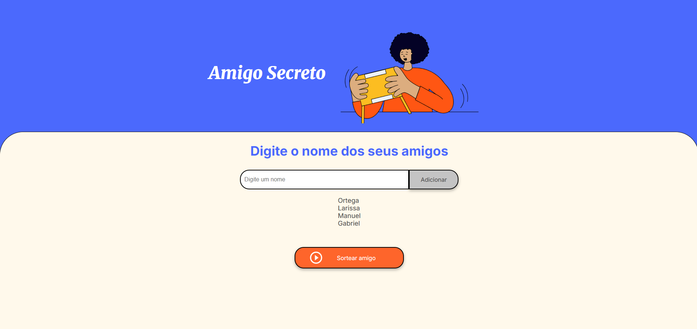
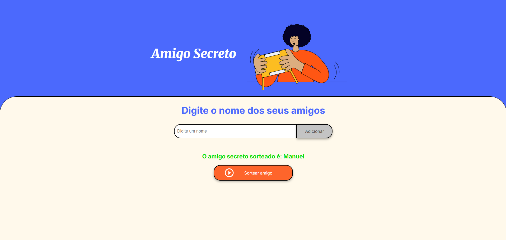

# Oracle Next Education (ONE) - Challenge Amigo Secreto

Challenge proposto pela Alura no programa de Formação Oracle Next Education G8, o intuito é fazer os alunos reforçarem conceitos básicos de lógica de programação, aprendidos na trilha de Introdução a Lógica de Programação.


## Conceitos abordados

- Estruturas condicionais (if-elseif-else)
- Estruturas de repetição (for-foreach)
- Criação e acionamento de funções / rotinas
- Arrays
- Biblioteca Math.Random


## Rodando localmente

Clone o projeto

```bash
  git clone https://github.com/GabsOrtega/one-challlenge-amigo-secreto.git
```

Entre no diretório do projeto

```bash
  cd one-challenge-amigo-secreto
```

Abra com o Visual Studio Code

```bash
  code .
```

## Imagens


